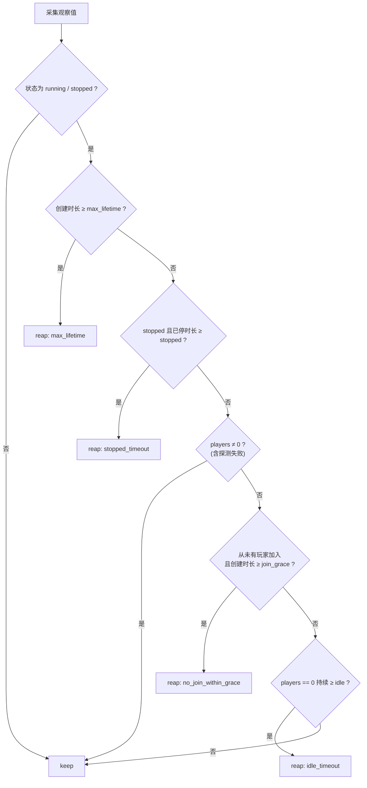

<div align="center">

# mcctl<br/>本地 Minecraft 临时服务器管理器


</div>

mcctl 是一个轻量的我的世界服务器管理器。在为短期、少量玩家、简单的 Minecraft 服务器提供便捷的创建、修改、删除服务。适用于快捷的朋友联机场景。

## 目录

- [开始之前](#开始之前)
- [架构](#架构)
- [环境要求](#环境要求)
- [安装](#安装)
- [快速开始](#快速开始)
- [命令参考](#命令参考)
- [HTTP 服务](#http-服务)
- [生命周期与存档](#生命周期与存档)
- [状态机](#状态机)
- [漂移修正](#漂移修正)
- [指定 Java](#指定-java)
- [配置](#配置)
- [配置参考](#配置参考)
- [设计约束](#设计约束)
- [开发](#开发)
- [版权声明](#版权声明)

## 开始之前

- mcctl 仅实现了单机、单用户的服务器管理功能，不适用于规模生产需求。
- mcctl 未提供网络相关基础设施 (如反向代理、TLS、DNS等)。实际对公网部署时需要单独配置。

## 架构

### 分层职责

| 层 | 职责 | 代码位置 |
| --- | --- | --- |
| runtime | `itzg/minecraft-server` 实例 | `mcctl/provisioners/` |
| orchestration | **核心**: 状态机、持久化、生命周期编排、漂移修正 | `mcctl/core/` |
| exposure | 对外暴露 (routes / DNS / edge) (暂未实现) | `mcctl/adapters/` |
| config | 配置文件、环境变量与内置默认值 | `mcctl/core/config.py` |
| http | 基于 FastAPI 的持久化 HTTP 服务 | `mcctl/api/` |

> [!NOTE]
> 编排层仅依赖 `mcctl/provisioners/base.py` 中定义的协议, 不依赖任何具体实现。这使得 runtime 可替换, 并允许在单元测试中使用假实现。

## 环境要求

| 依赖 | 版本 / 说明 |
| --- | --- |
| Python | 3.11 或更高 |
| Docker | 宿主机可直接访问 Docker daemon |
| Python 依赖 | `docker`、`typer`、`fastapi`、`uvicorn` (安装时自动获取) |

## 安装

```bash
python -m venv .venv

# Windows
.venv\Scripts\activate
# Linux / macOS
source .venv/bin/activate

pip install -e .
```

## 快速开始

```bash
mcctl init                       # 创建 mc-net 网络与 mc-router 容器
mcctl create test                # 创建实例并等待就绪(首次需拉取镜像并生成世界,耗时较长)
mcctl create paper21 --java 21   # 指定 Java 21(切换至官方 java21 镜像 tag)
mcctl list                       # 列出全部实例
mcctl endpoint test              # 打印连接地址
mcctl config --write             # 生成带注释的示例配置文件
```

若成功创建, 终端会输出连接方式:

```text
连接地址: test.mc.loc:25565
提示: 在 MC 客户端中填入以上地址;若域名未解析,请在本机 hosts 加入:
      127.0.0.1 test.mc.loc
```

此处, mc.loc 是您定义的域名。如果您将该服务对公网开放，则需要为 mcctl 服务设置 DNS 解析； 如果仅本地测试, 则需要修改 Hosts 指向 mcctl.

> [!TIP]
> 清理实例: `mcctl rm test`。该命令删除容器与数据卷, 执行前会二次确认。

## 命令参考

基本格式: `mcctl <operation> [params]`

| 命令 | 主要参数 | 说明 |
| --- | --- | --- |
| `config` | `[--write] [--path]` | 查看或生成配置文件 |
| `init` | — | 创建 `mc-net` 网络与 `mc-router` 容器。初次运行前需执行此命令 |
| `create` | `<name> [--type paper] [--version 1.21] [--memory 2G] [--java 21] [--ttl 60] [--offline]` | 创建实例并等待就绪;未提供的参数取自配置 `defaults` 段 |
| `list` | — | 列出全部实例 |
| `start` | `<name>` | 启动已停止的实例 |
| `stop` | `<name>` | 暂停实例 |
| `rm` | `<name> [-y] [--no-archive]` | 删除容器与数据卷(默认先归档数据卷) |
| `logs` | `<name> [-n 100]` | 查看容器日志 |
| `endpoint` | `<name>` | 打印连接地址 |
| `players` | `<name>` | 查询在线人数 |
| `reconcile` | — | 比对数据库期望状态与 Docker 实际状态, 修正漂移 (见下文[漂移修正](#漂移修正)) |
| `serve` | `[--host] [--port]` | 启动持久 HTTP 服务 (见下文) |
| `reap` | — | 手动执行生命周期巡检 |
| `restore` | `<name> [--type] [--version] [--memory] [--java] [--offline]` | 依据保存的同名存档重建实例 |
| `archive list` | — | 列出全部存档 (名称 / 大小 / 过期时间) |
| `archive pack` | `<name>` | 仅打包数据卷, 不停止或删除实例 |
| `archive download` | `<name> [-o 路径] [--refresh]` | 下载存档 (实例已删除时同样可用) |
| `archive purge` | `<name> [-y]` | 丢弃存档并释放服务器名 |

全局选项:`-v/--verbose` 开启调试日志; `-c/--config <path>` 指定配置文件 (对所有子命令生效)。

## HTTP 服务

`mcctl serve` 启动一个持久 HTTP 服务 (FastAPI + uvicorn), 将上述操作暴露为接口, **全部以服务器名为索引**。服务会同时运行一个后台生命周期巡检任务。

### 鉴权

在配置文件中设置密钥(必填):

```toml
[api]
key = "换成只有你知道的随机串"
```

该密钥建议使用强密码。如果没有配置密码, 则 mcctl 服务会拒绝启动。

以下两种请求头等价:

```bash
curl -H "X-API-Key: $KEY" http://127.0.0.1:8765/servers
curl -H "Authorization: Bearer $KEY" http://127.0.0.1:8765/servers
```

### 接口参考

| 方法 | 路径 | 说明 |
| --- | --- | --- |
| `GET` | `/healthz` | 状态检查: 版本、实例数、存档数、巡检开关 |
| `GET` | `/servers` | 列出全部实例 (按创建时间排序) |
| `POST` | `/servers` | 创建实例, 返回 `201`, **阻塞至服务端就绪** (见下文[并发模型](#并发模型)) |
| `GET` | `/servers/{name}` | 实例详情; `?players=false` 可跳过在线人数探测 |
| `POST` | `/servers/{name}/start` | 启动已停止的实例 |
| `POST` | `/servers/{name}/stop` | 优雅关停 (保留容器与数据卷) |
| `DELETE` | `/servers/{name}` | 关停 + 归档 + 删除, 响应中返回存档信息 |
| `GET` | `/servers/{name}/logs` | 日志尾部; `?tail=100` (取值 1–5000) |
| `POST` | `/servers/{name}/archive` | 仅打包数据卷 (不删除实例) |
| `GET` | `/servers/{name}/archive` | 下载存档 (`application/gzip`); 实例已删除时同样可用 |
| `POST` | `/servers/{name}/restore` | 依据同名存档重新创建实例 |
| `GET` | `/archives` | 存档列表 (名称 / 大小 / 创建时间 / 过期时间) |
| `GET` | `/archives/{name}` | 存档详情 |
| `DELETE` | `/archives/{name}` | 丢弃存档并释放服务器名, 返回 `204` |
| `GET` | `/lifecycle` | 当前生命周期策略 |
| `POST` | `/lifecycle/reap` | 立即执行一轮巡检 |

### 创建、删除与还原示例

`POST /servers` 的请求体与 `mcctl create` 参数一一对应, 未提供的字段取自 `[defaults]`:

```bash
# 创建实例
curl -X POST http://127.0.0.1:8765/servers \
  -H "X-API-Key: $KEY" -H "Content-Type: application/json" \
  -d '{"name": "test", "type": "paper", "version": "1.21", "memory": "2G", "java": "21"}'

# 删除(自动归档)并下载刚生成的存档
curl -X DELETE http://127.0.0.1:8765/servers/test -H "X-API-Key: $KEY"
curl -o test.tar.gz http://127.0.0.1:8765/servers/test/archive -H "X-API-Key: $KEY"

# 以新名称还原
curl -X POST http://127.0.0.1:8765/servers/test/restore -H "X-API-Key: $KEY" -d '{}'
```

### 状态码约定

| 状态码 | 触发条件 |
| --- | --- |
| `404` | 名称不存在 |
| `409` | 名称被活跃实例或保留期内的存档占用 |
| `400` / `422` | 参数非法 |
| `504` | 创建或启动超时 |

> [!NOTE]
> 对于实例已删除、仅存存档的名称, **实例类接口一律返回 `404`** (该名称也不会出现在 `GET /servers` 中), 而**存档类接口正常返回 `200`**。也就是说, 对于已删除且处于存档其内的实例, 无法通过其名称获取到服务器; 而能够通过名称获取到归档的存档。

### 并发模型

写操作 (创建 / 重建 / 启停 / 删除 / 打包 / 丢弃) 共用同一把进程内锁, 后台巡检也使用同一把锁。因此, 创建服务器的任务**并发进入, 顺序处理**; 巡检不会中断创建过程中的实例。  
读操作不加锁。

## 生命周期与存档

### 回收

规则在配置文件的 `[lifecycle]` 段中配置,单位为分钟,取值 `0` 表示关闭该条规则。

| 规则 | 配置项 | 默认值 | 含义 | 执行 |
| --- | --- | --- | --- | --- |
| 无人加入 | `join_grace` | 10 | 创建后此时长内**无任何玩家加入** | 归档并删除 |
| 持续空闲 | `idle` | 60 | 玩家数**持续为 0** 达此时长 | 归档并删除 |
| 超出寿命 | `max_lifetime` | 1440 | 创建时长超过 24 小时 | 归档并删除 |
| 停止超时 | `stopped` | 1440 | 被 `stop` 后一直未启动,持续此时长 | 归档并删除 |

与此有关的配置文件相应部分示例如下:

```toml
[lifecycle]
enabled = true           # 是否启用巡检
interval = 30            # 巡检间隔 (秒)
join_grace = 10          # 创建后空闲阈值 (自创建以来无人加入的时间) (分)
idle = 60                # 空闲阈值 (服务器持续无人的时间)
max_lifetime = 1440      # 创建时长超过 24 小时
stopped = 1440           # 停止状态持续超过 24 小时
archive_retention = 1440 # 存档额外保留 24 小时
```

判定顺序与行为约束:

1. 判定顺序为 `max_lifetime → stopped → join_grace → idle`。
2. 存在在线玩家 (`players > 0`) 的实例不回收。
3. 人数探测失败 (实例尚未就绪或无法读取) 时不进行任何判定。
4. `stopped` 是上述约束的唯一例外: 处于停止状态的容器本就无法探测人数, 因此该规则不依赖人数判定。
5. 仅 `running` 与 `stopped` 状态下的实例会被回收; `creating`、`stopping` 等过渡态不受影响。
6. 单条规则设为 `0` 可关闭该规则; `enabled = false` 关闭整个巡检功能 (不影响[命令参考](#命令参考)中提及的手动巡检)。



### 存档

删除操作遵循**先归档、后删除**。任何非意外删除 (`mcctl rm`、接口 `DELETE /servers/{name}`、生命周期回收等) 都会将数据卷打包为 `<存档目录>/<slug>.tar.gz`, 并在数据库中保留一条索引记录:

1. 实例虽已删除, 但服务器名仍被占用, 占用期即 `archive_retention` 分钟 (默认自服务器删除起 24 小时)。
2. 在此期间存档下载正常提供 (接口 `GET /servers/{name}/archive`、CLI `mcctl archive download <name>`), 内容为删除前一刻的世界数据。
3. 需要继续使用时, 可依据该存档重建: `mcctl restore <name>` 或 `POST /servers/{name}/restore`。重建流程会先用原 slug 抢回名称, 解包存档后再启动容器, 因此世界与玩家数据原样恢复; 重建成功后存档被消费, 名称随之释放。未显式提供的参数沿用存档中记录的原始配置。
4. 归档失败会直接报错且不执行删除。
5. 若数据卷本就不存在 (例如已被手工清理), 则不产生存档, 名称立即可复用。
6. 存档被丢弃时 (`mcctl archive purge`、接口 `DELETE /archives/{name}`、巡检清理到期存档), 数据库中对应的占位 `destroyed` 记录也会一并删除。该占位记录的唯一用途是为存档保留名称, 存档消失后继续保留只会永久占用 slug。

## 状态机

```text
creating ──► running ──► stopping ──► stopped ──► destroyed
    │           │            │
    └───────────┴────────────┴──► failed ──► destroyed
```

`destroyed` 为终态。  
`failed` 或 `creating` 状态下的实例可以再次执行 `mcctl create <name>` 继续创建 (幂等重放: 复用已创建的 volume 与容器), 也可以在修正后通过 `mcctl rm` 清除。

## 漂移修正

在一些情况下, 对 docker 容器的一些直接操作会导致 mcctl 的数据库与容器实际状态不匹配。使用 `mcctl reconcile` 命令可将数据库中的期望状态与 Docker 的实际状态进行比对, 并修正差异:

| 实际情况 | 处理结果 |
| --- | --- |
| 容器被手工 `docker rm -f` 删除 | 数据库标记为 `failed` |
| 容器被手工 `docker stop` 停止 | 数据库同步为 `stopped`, 同时写入 `stopped_since`, 计入 `stopped` 回收规则的计时 |

## 指定 Java

`mcctl create --java` 支持两种写法, 分别对应 itzg 官方支持的两种机制。

### 方式一: 版本号映射至官方镜像 tag

```bash
mcctl create test --java 21          # itzg/minecraft-server:java21
mcctl create test --java 17          # itzg/minecraft-server:java17
mcctl create test --java java21-jdk  # 也可直接写官方 tag(含 -jdk 变体)
mcctl create test --java 1.8         # 旧写法, 归一化为 java8
```

`itzg/minecraft-server` 不提供"选择 Java 版本"的环境变量 (镜像脚本中的 `JAVA_VERSION` 仅用于解析 JDK 自带的 `release` 文件, 以判定当前版本), 切换 Java 版本的官方方式即更换 image tag (参见官方文档 *Java* 页的 image tags 表)。因此 `mcctl` 依据官方 tag 更换镜像。映射方法如下表。

| `--java` | 实际使用的镜像 |
| --- | --- |
| *(不填)* | `itzg/minecraft-server` (默认 tag) |
| `8` / `1.8` | `itzg/minecraft-server:java8` |
| `11` | `itzg/minecraft-server:java11` |
| `16` | `itzg/minecraft-server:java16` |
| `17` | `itzg/minecraft-server:java17` |
| `21` | `itzg/minecraft-server:java21` |
| `25` | `itzg/minecraft-server:java25` |
| `java21-jdk` 等 | 原样作为 tag |

### 方式二:宿主机 JDK 路径 (只读挂载 + `JAVA_HOME` / `PATH`)

```bash
# 指向 bin 目录或 JDK 根目录均可
mcctl create test --java /usr/lib/jvm/java-21-openjdk-amd64/bin
mcctl create test --java /usr/lib/jvm/java-21-openjdk-amd64
```

`mcctl` 会将该 JDK **以只读方式挂载到容器内** `/opt/mcctl-java`, 并设置以下环境变量:

| 变量 | 取值 |
| --- | --- |
| `JAVA_HOME` | `/opt/mcctl-java` |
| `PATH` | `/opt/mcctl-java/bin:<镜像原有 PATH>` |

约束条件:

- **必须是 Linux 版 JDK**。若目录中仅有 `java.exe` 会被直接拒绝: 容器为 Linux 环境, 无法执行 `java.exe`。Windows 宿主机同样可使用本功能, 只需目录中为解压得到的 Linux 版 JDK。
- **不新增任何端口映射**。宿主机 JDK 目录以 `ro` 挂载。
- 选择结果记录在 `instances.java` 列 (旧库会自动 `ALTER TABLE` 补列), 可通过 `mcctl list` 的 `JAVA` 列查看。
- **更换 `--java` 需先删除容器**。`mcctl create` 对已存在的实例执行"续跑复用", 不会重建容器。如需更换 Java, 请先执行 `mcctl rm <name>`, 再执行 `mcctl create <name> --java ...` (与修改 router 配置同理)。

## 配置

在命令行逐一传递参数较为繁琐, 因此域名、`mc-router` 的宿主机端口, 以及 `create` 的默认值均可写入一个 TOML 文件。mcctl 使用 Python 3.11 的 `tomllib` 解析配置文件。

优先级(由高到低):

```text
命令行 --config / 环境变量 MCCTL_*   >   配置文件   >   内置默认值
```

配置文件按以下顺序查找:

1. 全局参数 `--config <path>` (简写 `-c`)
2. 环境变量 `MCCTL_CONFIG`
3. `$MCCTL_HOME/config.toml` (默认 `~/.mcctl/config.toml`)

```bash
mcctl config --write      # 写入当前生效值(已存在则报错,加 --force 覆盖)
mcctl config --path       # 仅打印配置文件路径
mcctl config              # 列出每个字段的当前生效值
```

输出内容来自一份**真实的 TOML 文件**: `mcctl/core/config.template.toml` (随包分发,不访问网络)。由于它不是 Python 字符串, 修改注释、增补说明或调整示例结构时直接编辑该文件即可; 其中的占位符(字段名以两对花括号包裹)会由 `--write` 替换为当时的生效值。占位符与字段的对应关系定义在 `mcctl/core/config.py` 的 `Config.to_toml_sample()`, 两侧不一致时测试会直接报错。

```bash
mcctl config
# 配置文件: /home/you/.mcctl/config.toml
# 优先级: 命令行 --config / 环境变量 MCCTL_*  >  配置文件  >  内置默认值
#
# 字段                     生效值
# ----------------------  ------------------------------
# domain                 mc.loc
# db                     /home/you/.mcctl/mcctl.db
# network                mc-net
# router.port            25565
# defaults.type          paper
# ...
```

### 示例配置

完整的带注释示例见 [`mcctl/core/config.template.toml`](mcctl/core/config.template.toml) (执行 `mcctl config --write` 会按当前生效值渲染出一份)。以下仅列出关键片段:

```toml
# 实例域名后缀:连接地址为 <slug>.<domain>:<router.port>
domain = "mc.loc"

[router]
name = "mc-router"
# 唯一对宿主机暴露的端口(默认仅绑定本机回环地址)
bind = "127.0.0.1"
port = 25565

[defaults]
# mcctl create 未显式传参时使用的默认值
type = "paper"
version = "1.21"
memory = "2048M"
online_mode = true
```

### 常见场景

<details>
<summary>更换本地域名</summary>

```toml
# 改为本地 hosts 中的另一个域名
domain = "mc.home.arpa"
```

</details>

<details>
<summary>更换 router 的宿主机端口</summary>

```toml
# 将 router 的宿主机端口由 25565 改为 25599
[router]
port = 25599
```

</details>

<details>
<summary>设置 create 的默认参数</summary>

```toml
# 默认使用 vanilla 1.20.4、1G 内存、离线模式
[defaults]
type = "vanilla"
version = "1.20.4"
memory = "1G"
online_mode = false
```

</details>

<details>
<summary>启用 HTTP 服务与生命周期巡检</summary>

```toml
# HTTP 服务:密钥必填,其余可省
[api]
key = "换成只有你知道的随机串"
bind = "127.0.0.1"
port = 8765
docs = false             # true = 暴露 /docs(不校验密钥,仅建议内网调试时开启)

# 自动回收 + 存档保留(单位分钟,0 = 关闭该条规则)
[lifecycle]
enabled = true
interval = 30
join_grace = 10
idle = 60
max_lifetime = 1440
stopped = 1440
archive_retention = 1440

# 存档目录(默认 <db 所在目录>/archives)与打包用的 helper 镜像
archives = "~/.mcctl/archives"
archive_image = "alpine:3"
```

</details>

配置修改后, `mcctl create <name>` 即刻生效:

```bash
mcctl create test          # 取 [defaults] 中的 type/version/memory/online_mode/ttl/java
mcctl create test -t paper # 命令行显式传入的参数优先
```

注意事项:

- **修改 `[router]` 的端口或网络后需重建 router 容器**: `mcctl init` 对已存在的 router 是幂等的, 不会重建。请先执行 `docker rm -f mc-router`, 再执行 `mcctl init`。
- **字段名错误会直接报错**, 不会静默忽略(未知字段会列出可用字段), 以避免"修改后无效果"。
- `mcctl config --write` 在配置文件尚不存在时也可使用: 它会依据环境变量与内置默认值先计算出当前生效值, 再写入文件。

## 配置参考

所有配置也可通过 `MCCTL_*` 环境变量覆盖, 且**优先级高于配置文件**。适用于临时修改。示例如下:

```bash
MCCTL_ROUTER_PORT=25599 mcctl config
mcctl --config /path/to/config.toml list   # 也可通过 --config 指定配置文件
```

### 路径与存储

| 变量 | 默认值 | 说明 |
| --- | --- | --- |
| `MCCTL_CONFIG` | `$MCCTL_HOME/config.toml` | 配置文件路径 |
| `MCCTL_DB` | `~/.mcctl/mcctl.db` | SQLite 数据库路径 |
| `MCCTL_HOME` | `~/.mcctl` | 数据目录 (未设置 `MCCTL_DB` 时使用 `<home>/mcctl.db`) |
| `MCCTL_ARCHIVES` | `<db 所在目录>/archives` | 存档目录 |
| `MCCTL_ARCHIVE_IMAGE` | `alpine:3` | 打包 / 解包数据卷使用的 helper 镜像 |

### Docker 与网络

| 变量 | 默认值 | 说明 |
| --- | --- | --- |
| `MCCTL_NETWORK` | `mc-net` | docker bridge 网络名称 |
| `MCCTL_DOCKER_SOCKET` | `/var/run/docker.sock` | 挂载给 router 的 docker socket |

### mc-router

| 变量 | 默认值 | 说明 |
| --- | --- | --- |
| `MCCTL_ROUTER_NAME` | `mc-router` | router 容器名称 |
| `MCCTL_ROUTER_IMAGE` | `itzg/mc-router` | router 镜像 |
| `MCCTL_ROUTER_BIND` | `127.0.0.1` | 唯一端口映射绑定的地址 |
| `MCCTL_ROUTER_PORT` | `25565` | 唯一端口映射的宿主机端口 |
| `MCCTL_ROUTER_SOCKET_GROUP` | 自动探测 | router 读取 socket 所需的附加组 GID; 留空时自动 `stat` socket 属组 |

### 实例默认值

| 变量 | 默认值 | 说明 |
| --- | --- | --- |
| `MCCTL_SERVER_IMAGE` | `itzg/minecraft-server` | 实例镜像 |
| `MCCTL_SERVER_PORT` | `25565` | 实例容器内监听端口(不映射至宿主机) |
| `MCCTL_DOMAIN` | `mc.loc` | 连接地址后缀, 最终为 `<slug>.<domain>` |
| `MCCTL_HEALTH_TIMEOUT` | `600` | 等待就绪超时(秒) |
| `MCCTL_HEALTH_POLL_INTERVAL` | `3` | 就绪轮询间隔(秒) |
| `MCCTL_DEFAULT_TYPE` | `paper` | `create` 默认服务端类型 |
| `MCCTL_DEFAULT_VERSION` | `1.21` | `create` 默认 Minecraft 版本 |
| `MCCTL_DEFAULT_MEMORY` | `2048M` | `create` 默认内存 |
| `MCCTL_DEFAULT_ONLINE_MODE` | `true` | `create` 默认是否启用正版验证 |
| `MCCTL_DEFAULT_TTL` | *(不设置)* | `create` 默认存活分钟数 |
| `MCCTL_DEFAULT_JAVA` | *(不设置)* | `create` 默认 Java 版本 / tag |

### HTTP 服务相关

| 变量 | 默认值 | 说明 |
| --- | --- | --- |
| `MCCTL_API_KEY` | *(不设置)* | HTTP 服务密钥 (**必填**) |
| `MCCTL_API_BIND` | `127.0.0.1` | HTTP 服务监听地址 |
| `MCCTL_API_PORT` | `8765` | HTTP 服务监听端口 |
| `MCCTL_API_DOCS` | `false` | 是否暴露 `/docs` 与 `/openapi.json` |

### 生命周期

| 变量 | 默认值 | 说明 |
| --- | --- | --- |
| `MCCTL_LIFECYCLE_ENABLED` | `true` | 是否开启生命周期巡检 |
| `MCCTL_LIFECYCLE_INTERVAL` | `30` | 巡检间隔(秒) |
| `MCCTL_JOIN_GRACE` | `10` | 创建后无人加入的回收阈值 (分钟,`0` = 关闭) |
| `MCCTL_IDLE_TIMEOUT` | `60` | 持续 0 人的回收阈值 (分钟, `0` = 关闭) |
| `MCCTL_MAX_LIFETIME` | `1440` | 最长存活时长 (分钟, `0` = 关闭) |
| `MCCTL_STOPPED_TIMEOUT` | `1440` | 停止状态持续多久后回收 (分钟, `0` = 关闭) |
| `MCCTL_ARCHIVE_RETENTION` | `1440` | 存档删除后的额外保留时长 (分钟) |

## 设计约束

- **实例容器不映射任何宿主机端口**, 仅接入 `mc-net`, 由 `mc-router` 在内网按容器名访问。因此实例模型中**不存在 `host_port` 字段**。
- 对宿主机暴露的**唯一**端口是 router 的 `127.0.0.1:25565:25565` (可通过配置文件的 `[router] bind` / `[router] port` 修改,但始终只有一个)。
- RCON **不开放端口**, 在线人数通过 `docker exec <container> rcon-cli list` 获取。
- 所有 `delete` 操作均清理容器与数据卷 (未来还会清理 routes / DNS); 删除前会先将数据卷归档为 `<存档目录>/<slug>.tar.gz`, 归档失败则不执行删除 (参见[生命周期与存档](#生命周期与存档))。
- `create` 为**分步骤**执行: `分配 slug → 创建 volume → 创建容器 → 等待健康 → 写入 DB`。每一步独立记录日志且可重放, 失败后状态落为 `failed`, 而非包裹在单一 `try` 块中; 使用存档重建时, 在"创建 volume"与"创建容器"之间增加一步"解包存档"。

## 开发

```bash
pip install -e ".[dev]"
pytest
```

各测试文件功能如下:

- `tests/test_engine.py` 使用内存中的假 Provisioner 覆盖 create 续跑、slug 冲突、reconcile 漂移、destroy 清理等编排逻辑, 以及 `rm` 归档、`restore` 重建、`purge` 释放名称这一段;
- `tests/test_lifecycle.py` 通过注入时钟验证四条回收规则的**边界**(恰好 10 分钟、恰好 60 分钟、恰好 24 小时、规则优先级、`0` / `enabled = false` 的关闭语义), 以及巡检与引擎的联动;
- `tests/test_archive.py` 与 `tests/test_store.py` 覆盖存档元数据、过期判定、`archives` 表读写与旧库迁移;
- `tests/test_api.py` 使用 starlette 的 `TestClient` 完整跑通 HTTP 层: 密钥鉴权(`X-API-Key` / Bearer / fail-closed)、创建 / 启停 / 删除 / 下载 / 重建、状态码映射;
- `tests/test_config.py` 覆盖配置文件的优先级(环境变量 > 文件 > 内置默认值)、字段校验与示例配置的回读一致性; 另锁定 `config.template.toml` 与 `Config.to_toml_sample()` 的同步关系(占位符集合、每个占位符仅出现一次、`#@template` 备注不外泄);
- `tests/test_cli_config.py` 将 `_build_engine` 替换为假 Provisioner, 验证"配置文件 → `create` 默认值 → 传递给 runtime 的 Spec"这条链路。

`tests/conftest.py` 会在每个用例前清空 `MCCTL_*` 环境变量, 并将 `MCCTL_HOME` 指向临时目录, 避免本机真实配置(`~/.mcctl/config.toml`)干扰测试结果。

## 版权声明

Copyright (C) 2026 daniuge233.
